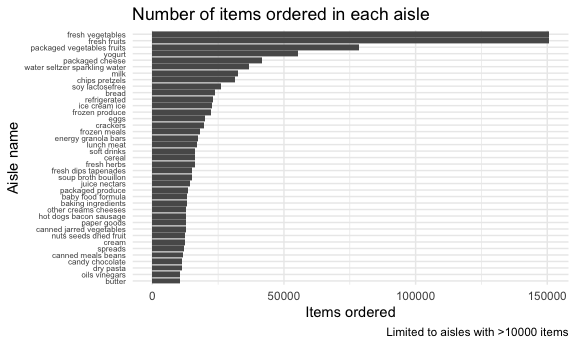
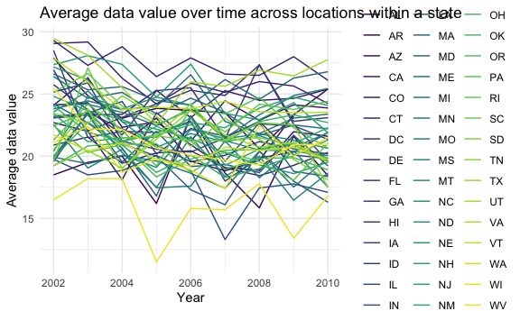
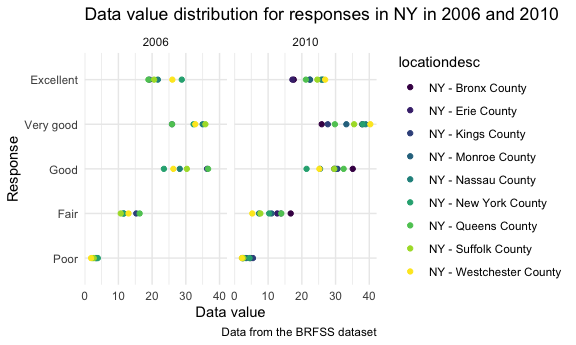

p8105\_hw3\_rr3423.Rmd
================
Ragyie Rawal
10/13/2021

## PROBLEM 1

### Loading Instacart dataset from p8105.datasets

``` r
data("instacart")
```

### Cleaning variable names in Instacart datacart

``` r
instacart_df = 
  instacart %>% 
  janitor::clean_names()
```

### Dataset exploration

``` r
rows_instacart = 
  instacart_df %>% 
  nrow() 

cols_instacart =
  instacart_df %>%
  ncol()

names_instacart =
  instacart_df %>%
  names()
```

The number of **rows** in the instacart dataset are **1384617**. The
number of **columns** in the instacart dataset are **15**. The **key
variables** in the instacart dataset are **order\_id, product\_id,
add\_to\_cart\_order, reordered, user\_id, eval\_set, order\_number,
order\_dow, order\_hour\_of\_day, days\_since\_prior\_order,
product\_name, aisle\_id, department\_id, aisle, department**.

### Aisles

How many aisles are there, and which aisles are the most items ordered
from?

``` r
instacart_df %>% 
  group_by(aisle) %>% 
  summarize(item_count = n()) %>% 
  arrange(desc(item_count))
```

    ## # A tibble: 134 × 2
    ##    aisle                         item_count
    ##    <chr>                              <int>
    ##  1 fresh vegetables                  150609
    ##  2 fresh fruits                      150473
    ##  3 packaged vegetables fruits         78493
    ##  4 yogurt                             55240
    ##  5 packaged cheese                    41699
    ##  6 water seltzer sparkling water      36617
    ##  7 milk                               32644
    ##  8 chips pretzels                     31269
    ##  9 soy lactosefree                    26240
    ## 10 bread                              23635
    ## # … with 124 more rows

There are 134 aisles in the instacart dataset. The top 3 aisles that the
most items are ordered from in descending order are: “fresh vegetables”,
“fresh fruits”, and “packaged vegetables fruits”.

### Constructing a plot of the number of items ordered in each aisle (more than 10000 items)

``` r
instacart_df %>% 
  group_by(aisle) %>% 
  summarize(item_count = n()) %>% 
  filter(item_count > 10000) %>% 
  ggplot(aes(x = reorder(aisle, item_count), y = item_count)) +
  geom_bar(stat = "identity") +
  coord_flip() + 
  labs(
    title = "Number of items ordered in each aisle",
    x = "Aisle name",
    y = "Items ordered",
    caption = "Limited to aisles with >10000 items"
  ) + 
  theme(axis.text.y = element_text(size = 7))
```



This plot shows that the top 3 aisles that the most items are ordered
from in descending order are: “fresh vegetables”, “fresh fruits”, and
“packaged vegetables fruits”.

### Constructing a table of three most popular items in each of the aisles “baking ingredients”, “dog food care”, “packaged vegetables fruits”

``` r
instacart_df %>% 
  filter(aisle %in% c("baking ingredients", "dog food care", "packaged vegetables fruits")) %>% 
  group_by(aisle, product_name) %>% 
  summarize(item_count = n()) %>% 
  filter(min_rank(desc(item_count)) < 4) %>% 
  arrange(desc(item_count), .by_group = TRUE) %>% 
  knitr::kable()
```

| aisle                      | product\_name                                 | item\_count |
|:---------------------------|:----------------------------------------------|------------:|
| baking ingredients         | Light Brown Sugar                             |         499 |
| baking ingredients         | Pure Baking Soda                              |         387 |
| baking ingredients         | Cane Sugar                                    |         336 |
| dog food care              | Snack Sticks Chicken & Rice Recipe Dog Treats |          30 |
| dog food care              | Organix Chicken & Brown Rice Recipe           |          28 |
| dog food care              | Small Dog Biscuits                            |          26 |
| packaged vegetables fruits | Organic Baby Spinach                          |        9784 |
| packaged vegetables fruits | Organic Raspberries                           |        5546 |
| packaged vegetables fruits | Organic Blueberries                           |        4966 |

This table shows that the top three popular items in the “baking
ingredients” aisle are: Light Brown Sugar with 499 items ordered, Pure
Baking Soda with 387 times ordered, and Cane Sugar with 336 times
ordered. The top three popular items in the “dog food care” aisle are:
Snack Sticks Chicken & Rice Recipe Dog Treats with 30 times ordered,
Organix Chicken & Brown Rice Recipe with 28 times ordered, and Small Dog
Biscuits with 26 times ordered. The top three popular items in the
“packaged vegetables fruits” aisle are: Organic Baby Spinach with 9784
times ordered, Organic Raspberries with 5546 times ordered, and Organic
Blueberries with 4966 times ordered.

### Constructing a table of mean hour of day at which Pink Lady Apples and Coffee Ice Cream are ordered on each day of the week

``` r
instacart_df %>% 
  filter(product_name %in% c("Pink Lady Apples", "Coffee Ice Cream")) %>% 
  group_by(product_name, order_dow) %>% 
  summarize(mean_hour = mean(order_hour_of_day, na.rm = TRUE)) %>% 
  pivot_wider(
    names_from = order_dow, 
    values_from = mean_hour
  ) %>% 
  knitr::kable(digits = 1)
```

| product\_name    |    0 |    1 |    2 |    3 |    4 |    5 |    6 |
|:-----------------|-----:|-----:|-----:|-----:|-----:|-----:|-----:|
| Coffee Ice Cream | 13.8 | 14.3 | 15.4 | 15.3 | 15.2 | 12.3 | 13.8 |
| Pink Lady Apples | 13.4 | 11.4 | 11.7 | 14.2 | 11.6 | 12.8 | 11.9 |

## PROBLEM 2

### Loading BRFSS dataset from p8105.datasets

``` r
data("brfss_smart2010")
```

### Data cleaning for BRFSS dataset

``` r
brfss_df = 
  brfss_smart2010 %>% 
  janitor::clean_names() %>%
  filter(topic %in% c("Overall Health")) %>% 
  filter(response %in% c("Excellent", "Very good", "Good", "Fair", "Poor")) %>% 
  mutate(response = forcats::fct_relevel(response, "Poor", "Fair", "Good", "Very good", "Excellent"))
```

### In 2002, which states were observed at 7 or more locations?

``` r
brfss_df %>% 
  filter(year == "2002") %>% 
  group_by(locationabbr) %>% 
  summarize(location_count = n_distinct(locationdesc)) %>% 
  filter(location_count >= 7)
```

    ## # A tibble: 6 × 2
    ##   locationabbr location_count
    ##   <chr>                 <int>
    ## 1 CT                        7
    ## 2 FL                        7
    ## 3 MA                        8
    ## 4 NC                        7
    ## 5 NJ                        8
    ## 6 PA                       10

In 2002, the following six states were observed at 7 or more locations:
CT, FL, MA, NC, NJ, PA.

### In 2010, which states were observed at 7 or more locations?

``` r
brfss_df %>% 
  filter(year == "2010") %>% 
  group_by(locationabbr) %>% 
  summarize(location_count = n_distinct(locationdesc)) %>% 
  filter(location_count >= 7)
```

    ## # A tibble: 14 × 2
    ##    locationabbr location_count
    ##    <chr>                 <int>
    ##  1 CA                       12
    ##  2 CO                        7
    ##  3 FL                       41
    ##  4 MA                        9
    ##  5 MD                       12
    ##  6 NC                       12
    ##  7 NE                       10
    ##  8 NJ                       19
    ##  9 NY                        9
    ## 10 OH                        8
    ## 11 PA                        7
    ## 12 SC                        7
    ## 13 TX                       16
    ## 14 WA                       10

In 2010, the following fourteen states were observed at 7 or more
locations: CA, CO, FL, MA, MD, NC, NE, NJ, NY, OH, PA, SC, TX, WA.

### Constructing a dataset limited to Excellent responses which contains year, state, and a variable that averages the data\_value across locations within a state.

``` r
# constructing dataset and making spaghetti plot
brfss_df %>% 
  filter(response %in% "Excellent") %>% 
  group_by(year, locationabbr) %>% 
  summarize(mean_data_value = mean(data_value, na.rm = TRUE)) %>% 
  ggplot(aes(x = year, y = mean_data_value, color = locationabbr)) + 
  geom_line(aes(group = locationabbr)) +
  labs(
    title = "Average data value over time across locations within a state",
    x = "Year",
    y = "Average data value"
  ) + 
  theme(legend.position = "right")
```

    ## `summarise()` has grouped output by 'year'. You can override using the `.groups` argument.



### Making a two-panel plot showing the distribution of data\_value for responses among locations in NY State for the years 2006 and 2010

``` r
brfss_df %>% 
  filter(
    year %in% c("2006", "2010"),
    locationabbr %in% c("NY")
  ) %>% 
  ggplot(aes(x = data_value, y = response)) + 
  geom_density_ridges(scale = 0.85) + 
  facet_grid(year ~ response)
```

    ## Picking joint bandwidth of 0.48

    ## Picking joint bandwidth of 1.42

    ## Picking joint bandwidth of 3.36

    ## Picking joint bandwidth of 2.75

    ## Picking joint bandwidth of 2.52

    ## Picking joint bandwidth of 0.708

    ## Picking joint bandwidth of 2.14

    ## Picking joint bandwidth of 2.25

    ## Picking joint bandwidth of 3.05

    ## Picking joint bandwidth of 1.99



## PROBLEM 3

### Loading accelerometer csv dataset

``` r
accel_df = 
  read_csv("data/accel_data.csv") %>% 
  janitor::clean_names() %>% 
  pivot_longer(
    activity_1:activity_1440,
    names_to = "activity",
    values_to = "activity_count"
  ) %>% 
  mutate(weekday_vs_weekend = case_when(day == "Monday" ~ "weekday",
                                        day == "Tuesday" ~ "weekday",
                                        day == "Wednesday" ~ "weekday",
                                        day == "Thursday" ~ "weekday", 
                                        day == "Friday" ~ "weekday",
                                        day == "Saturday" ~ "weekend",
                                        day == "Sunday" ~ "weekend")) %>% 
  select(week, day_id, day, weekday_vs_weekend, everything())
```

    ## Rows: 35 Columns: 1443

    ## ── Column specification ────────────────────────────────────────────────────────
    ## Delimiter: ","
    ## chr    (1): day
    ## dbl (1442): week, day_id, activity.1, activity.2, activity.3, activity.4, ac...

    ## 
    ## ℹ Use `spec()` to retrieve the full column specification for this data.
    ## ℹ Specify the column types or set `show_col_types = FALSE` to quiet this message.
