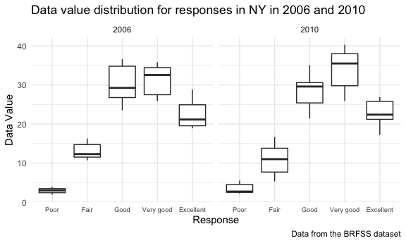
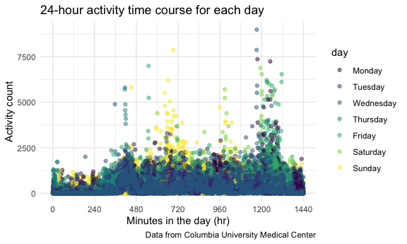

p8105\_hw3\_rr3423.Rmd
================
Ragyie Rawal
10/13/2021

## PROBLEM 1

### Loading Instacart dataset from p8105.datasets

``` r
data("instacart")
```

### Dataset exploration

``` r
rows_instacart = 
  instacart %>% 
  nrow() 

cols_instacart =
  instacart %>%
  ncol()

names_instacart =
  instacart %>%
  names()
```

The number of **rows** in the instacart dataset are **1384617**. The
number of **columns** in the instacart dataset are **15**. The **key
variables** in the instacart dataset are **order\_id, product\_id,
add\_to\_cart\_order, reordered, user\_id, eval\_set, order\_number,
order\_dow, order\_hour\_of\_day, days\_since\_prior\_order,
product\_name, aisle\_id, department\_id, aisle, department**. The
dataset contains 1,384,617 observations, and each row in the dataset
represents a product from an instacart order. The dataset gives
information on the order, such as providing an order id, the order day
of the week, the order hour of the day, the product name, and the aisle
and department names.

### Aisles

How many aisles are there, and which aisles are the most items ordered
from?

``` r
instacart %>% 
  group_by(aisle) %>% 
  summarize(item_count = n()) %>% 
  arrange(desc(item_count))
```

    ## # A tibble: 134 × 2
    ##    aisle                         item_count
    ##    <chr>                              <int>
    ##  1 fresh vegetables                  150609
    ##  2 fresh fruits                      150473
    ##  3 packaged vegetables fruits         78493
    ##  4 yogurt                             55240
    ##  5 packaged cheese                    41699
    ##  6 water seltzer sparkling water      36617
    ##  7 milk                               32644
    ##  8 chips pretzels                     31269
    ##  9 soy lactosefree                    26240
    ## 10 bread                              23635
    ## # … with 124 more rows

There are 134 aisles in the instacart dataset. The top 3 aisles that the
most items are ordered from are: “fresh vegetables” with 150609 items
ordered, “fresh fruits” with 150473 items ordered, and “packaged
vegetables fruits” with 78493 items ordered.

### Constructing a plot of the number of items ordered in each aisle (more than 10000 items ordered)

``` r
instacart %>% 
  group_by(aisle) %>% 
  summarize(item_count = n()) %>% 
  filter(item_count > 10000) %>% 
  ggplot(aes(x = reorder(aisle, item_count), y = item_count)) +
  geom_bar(stat = "identity") +
  coord_flip() + 
  labs(
    title = "Number of items ordered in each aisle (>10000 items)",
    x = "Aisle name",
    y = "Items ordered",
    caption = "Data from the instacart dataset"
  ) + 
  theme(axis.text.y = element_text(size = 7))
```


This plot shows that the top 3 aisles that the most items are ordered
from in descending order are: “fresh vegetables”, “fresh fruits”, and
“packaged vegetables fruits”. The butter aisle has the lowest number of
items ordered.

### Constructing a table of three most popular items in each of the aisles “baking ingredients”, “dog food care”, “packaged vegetables fruits”

``` r
instacart %>% 
  filter(aisle %in% c("baking ingredients", "dog food care", "packaged vegetables fruits")) %>% 
  group_by(aisle, product_name) %>% 
  summarize(item_count = n()) %>% 
  filter(min_rank(desc(item_count)) < 4) %>% 
  arrange(desc(item_count), .by_group = TRUE) %>% 
  knitr::kable(caption = "**Table 1: Three most popular items in specific aisles**")
```

| aisle                      | product\_name                                 | item\_count |
|:---------------------------|:----------------------------------------------|------------:|
| baking ingredients         | Light Brown Sugar                             |         499 |
| baking ingredients         | Pure Baking Soda                              |         387 |
| baking ingredients         | Cane Sugar                                    |         336 |
| dog food care              | Snack Sticks Chicken & Rice Recipe Dog Treats |          30 |
| dog food care              | Organix Chicken & Brown Rice Recipe           |          28 |
| dog food care              | Small Dog Biscuits                            |          26 |
| packaged vegetables fruits | Organic Baby Spinach                          |        9784 |
| packaged vegetables fruits | Organic Raspberries                           |        5546 |
| packaged vegetables fruits | Organic Blueberries                           |        4966 |

**Table 1: Three most popular items in specific aisles**

This table shows that the top three popular items in the “baking
ingredients” aisle are: Light Brown Sugar with 499 items ordered, Pure
Baking Soda with 387 times ordered, and Cane Sugar with 336 times
ordered. The top three popular items in the “dog food care” aisle are:
Snack Sticks Chicken & Rice Recipe Dog Treats with 30 times ordered,
Organix Chicken & Brown Rice Recipe with 28 times ordered, and Small Dog
Biscuits with 26 times ordered. The top three popular items in the
“packaged vegetables fruits” aisle are: Organic Baby Spinach with 9784
times ordered, Organic Raspberries with 5546 times ordered, and Organic
Blueberries with 4966 times ordered.

### Constructing a 2x7 table of mean hour of day at which Pink Lady Apples and Coffee Ice Cream are ordered on each day of the week

``` r
instacart %>% 
  mutate(
    order_dow = recode(order_dow,
                       "0" = "Sunday",
                       "1" = "Monday",
                       "2" = "Tuesday",
                       "3" = "Wednesday",
                       "4" = "Thursday",
                       "5" = "Friday",
                       "6" = "Saturday")
  ) %>% 
  filter(product_name %in% c("Pink Lady Apples", "Coffee Ice Cream")) %>% 
  group_by(product_name, order_dow) %>% 
  summarize(mean_hour = mean(order_hour_of_day, na.rm = TRUE)) %>% 
  pivot_wider(
    names_from = order_dow,
    values_from = mean_hour
  ) %>%  
  select(product_name, Monday, Tuesday, Wednesday, Thursday, Friday, Saturday, Sunday, everything()) %>% 
  knitr::kable(
    digits = 1,
    caption = "**Table 2: Mean hour of day for pink lady apples and coffee ice cream orders**"
  )
```

| product\_name    | Monday | Tuesday | Wednesday | Thursday | Friday | Saturday | Sunday |
|:-----------------|-------:|--------:|----------:|---------:|-------:|---------:|-------:|
| Coffee Ice Cream |   14.3 |    15.4 |      15.3 |     15.2 |   12.3 |     13.8 |   13.8 |
| Pink Lady Apples |   11.4 |    11.7 |      14.2 |     11.6 |   12.8 |     11.9 |   13.4 |

**Table 2: Mean hour of day for pink lady apples and coffee ice cream
orders**

Based on this table, it appears that pink lady apples are ordered
earlier in the day on most days (Monday, Tuesday, Wednesday, Thursday,
Saturday, Sunday) when compared to coffee ice cream. However, on
Fridays, coffee ice cream is ordered slightly earlier than pink lady
apples. In addition, coffee ice cream is ordered earliest in the day on
Fridays when compared to the rest of the week. Pink lady apples are
ordered earliest in the day on Mondays. Coffee ice cream is ordered
latest in the day on Tuesdays. Pink lady apples are ordered latest in
the day on Wednesdays.

## PROBLEM 2

### Loading BRFSS dataset from p8105.datasets

``` r
data("brfss_smart2010")
```

### Data cleaning for BRFSS dataset

``` r
brfss_df = 
  brfss_smart2010 %>% 
  janitor::clean_names() %>%
  filter(topic %in% c("Overall Health")) %>% 
  filter(response %in% c("Excellent", "Very good", "Good", "Fair", "Poor")) %>% 
  mutate(response = forcats::fct_relevel(response, "Poor", "Fair", "Good", "Very good", "Excellent"))
```

### In 2002, which states were observed at 7 or more locations?

``` r
brfss_df %>% 
  filter(year == "2002") %>% 
  group_by(locationabbr) %>% 
  summarize(location_count = n_distinct(locationdesc)) %>% 
  filter(location_count >= 7)
```

    ## # A tibble: 6 × 2
    ##   locationabbr location_count
    ##   <chr>                 <int>
    ## 1 CT                        7
    ## 2 FL                        7
    ## 3 MA                        8
    ## 4 NC                        7
    ## 5 NJ                        8
    ## 6 PA                       10

In 2002, the following six states were observed at 7 or more locations:
CT, FL, MA, NC, NJ, PA.

### In 2010, which states were observed at 7 or more locations?

``` r
brfss_df %>% 
  filter(year == "2010") %>% 
  group_by(locationabbr) %>% 
  summarize(location_count = n_distinct(locationdesc)) %>% 
  filter(location_count >= 7)
```

    ## # A tibble: 14 × 2
    ##    locationabbr location_count
    ##    <chr>                 <int>
    ##  1 CA                       12
    ##  2 CO                        7
    ##  3 FL                       41
    ##  4 MA                        9
    ##  5 MD                       12
    ##  6 NC                       12
    ##  7 NE                       10
    ##  8 NJ                       19
    ##  9 NY                        9
    ## 10 OH                        8
    ## 11 PA                        7
    ## 12 SC                        7
    ## 13 TX                       16
    ## 14 WA                       10

In 2010, the following fourteen states were observed at 7 or more
locations: CA, CO, FL, MA, MD, NC, NE, NJ, NY, OH, PA, SC, TX, WA.

### Constructing a dataset and spaghetti plot limited to Excellent responses which contains year, state, and a variable that averages the data value across locations within a state.

``` r
# constructing dataset and making spaghetti plot
brfss_df %>% 
  filter(response %in% "Excellent") %>% 
  group_by(year, locationabbr) %>% 
  summarize(mean_data_value = mean(data_value, na.rm = TRUE)) %>% 
  ggplot(aes(x = year, y = mean_data_value, color = locationabbr)) + 
  geom_line(aes(group = locationabbr)) +
  labs(
    title = "Average data value over time across locations within a state",
    x = "Year",
    y = "Average data value",
    caption = "Data from the BRFSS dataset"
  ) + 
  theme(legend.position = "right")
```


Looking at this spaghetti plot, it seems that the average data value
across locations within a state seem to fluctuate from year to year in
many states between 2002 and 2010. There is a lot of variability in this
graph from year to year. This graph is not very informative because it
is difficult to distinguish between the different states.

### Making a two-panel plot showing the distribution of data value for responses among locations in NY State for the years 2006 and 2010

``` r
brfss_df %>% 
  filter(
    year %in% c("2006", "2010"),
    locationabbr %in% c("NY")
  ) %>% 
  ggplot(aes(x = response, y = data_value)) + 
  geom_boxplot() + 
  facet_grid(. ~ year) + 
  labs(
    title = "Data value distribution for responses in NY in 2006 and 2010",
    x = "Response",
    y = "Data Value",
    caption = "Data from the BRFSS dataset"
  ) + 
  theme(legend.position = "right",
        axis.text.x = element_text(size = 7))
```



Between 2006 and 2010, the distributions of data values for responses
vary among the different types of responses. For some responses, such as
poor response or excellent response, the distributions appear pretty
similar. For other responses, the distributions are different. For
example, the very good response distributions are different, with the
median value for the 2010 distribution being higher than the median
value for the 2006 distribution.

## PROBLEM 3

### Loading and tidying accelerometer csv dataset

``` r
accel_df = 
  read_csv("data/accel_data.csv") %>% 
  janitor::clean_names() %>% 
  pivot_longer(
    activity_1:activity_1440,
    names_to = "activity_minute",
    names_prefix = "activity_",
    values_to = "activity_count"
  ) %>% 
  mutate(
    weekday_vs_weekend = case_when(day == "Monday" ~ "weekday",
                                   day == "Tuesday" ~ "weekday",
                                   day == "Wednesday" ~ "weekday",
                                   day == "Thursday" ~ "weekday",
                                   day == "Friday" ~ "weekday",
                                   day == "Saturday" ~ "weekend",
                                   day == "Sunday" ~ "weekend"),
    activity_minute = as.integer(activity_minute),
    week = as.integer(week),
    day_id = as.integer(day_id),
    day = factor(day, levels = c("Monday", "Tuesday", "Wednesday", "Thursday", "Friday", "Saturday", "Sunday"))
  ) %>% 
  select(week, day_id, day, weekday_vs_weekend, everything())
```

    ## Rows: 35 Columns: 1443

    ## ── Column specification ────────────────────────────────────────────────────────
    ## Delimiter: ","
    ## chr    (1): day
    ## dbl (1442): week, day_id, activity.1, activity.2, activity.3, activity.4, ac...

    ## 
    ## ℹ Use `spec()` to retrieve the full column specification for this data.
    ## ℹ Specify the column types or set `show_col_types = FALSE` to quiet this message.

### Describing the accelerometer dataset

``` r
variables_accel = 
  accel_df %>% 
  names()

dim_accel = 
  accel_df %>% 
  dim()

rows_accel = 
  accel_df %>% 
  nrow()

cols_accel = 
  accel_df %>% 
  ncol()
```

This tidied accelerometer dataset represents five weeks of accelerometer
data for one individual. This dataset contains a variable for the
activity minute, which represents each minute of a 24-hour day starting
at midnight for the activity count data. This tidied dataset also
contains a weekday vs. weekend variable which determines if the day of
the week being represented is a weekday or a weekend day.

The **key variables** in this tidied dataset are **week, day\_id, day,
weekday\_vs\_weekend, activity\_minute, activity\_count**. The
**dimensions** of this tidied dataset are **50400, 6**. The **number of
rows** in this tidied dataset are **50400**. The **number of columns**
in this tidied dataset are **6**.

### Creating a table aggregated across minutes showing total activity over each day

``` r
accel_df %>% 
  group_by(day) %>% 
  summarize(total_activity = sum(activity_count, na.rm = TRUE)) %>% 
  knitr::kable(
    digits = 1,
    caption = "**Table 3: Total activity variable for each day**")
```

| day       | total\_activity |
|:----------|----------------:|
| Monday    |         1858699 |
| Tuesday   |         1799238 |
| Wednesday |         2129772 |
| Thursday  |         2091151 |
| Friday    |         2291711 |
| Saturday  |         1369237 |
| Sunday    |         1919213 |

**Table 3: Total activity variable for each day**

Based on this table, it appears that the total activity in minutes is
lowest on Saturdays compared to the rest of the week. The total activity
in minutes is highest on Fridays compared to the rest of the week. The
total activity for Wednesdays, Thursdays, and Fridays are higher than
the other days of the week.

### Creating a single-panel plot showing the 24-hour activity time course in minutes for each day

``` r
accel_df %>% 
  group_by(day, activity_minute) %>% 
  ggplot(aes(x = activity_minute, y = activity_count, color = day)) + 
  geom_point(alpha = 0.5) + 
  labs(
    title = "24-hour activity time course for each day",
    x = "Minutes in the day (hr)",
    y = "Activity count",
    caption = "Data from Columbia University Medical Center"
  ) + 
  theme(legend.position = "right") + 
  scale_x_continuous(
    breaks = c(0, 240, 480, 720, 960, 1200, 1440))
```



Based on this single-panel graph, it appears that the activity count is
higher later in the day, since the activity count is higher in the later
minutes of the day (around 1200 minutes), particularly during the
weekdays (Monday - Friday). On the weekends (Saturday and Sunday), it
appears that the activity count is higher in the middle of the day
(around 720 minutes).
