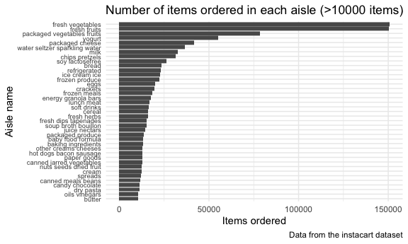

p8105\_hw3\_rr3423.Rmd
================
Ragyie Rawal
10/13/2021

## PROBLEM 1

### Loading Instacart dataset from p8105.datasets

``` r
data("instacart")
```

### Cleaning variable names in Instacart datacart

``` r
instacart_df = 
  instacart %>% 
  janitor::clean_names()
```

### Dataset exploration

``` r
rows_instacart = instacart_df %>% nrow()
cols_instacart = instacart_df %>% ncol()
names_instacart = instacart_df %>% names()
```

The number of **rows** in the instacart dataset are **1384617**. The
number of **columns** in the instacart dataset are **15**. The **key
variables** in the instacart dataset are **order\_id, product\_id,
add\_to\_cart\_order, reordered, user\_id, eval\_set, order\_number,
order\_dow, order\_hour\_of\_day, days\_since\_prior\_order,
product\_name, aisle\_id, department\_id, aisle, department**.

### Aisles

How many aisles are there, and which aisles are the most items ordered
from?

``` r
analyze_aisle = 
  instacart_df %>% 
  group_by(aisle) %>% 
  summarize(item_count = n()) %>% 
  arrange(desc(item_count))
```

There are 134 aisles in the instacart dataset. The top 3 aisles that the
most items are ordered from in descending order are: “fresh vegetables”,
“fresh fruits”, and “packaged vegetables fruits”.

### Plot: number of items ordered in each aisle (more than 1000 items)

``` r
plot_aisle = 
  instacart_df %>% 
  group_by(aisle) %>% 
  summarize(item_count = n()) %>% 
  filter(item_count > 10000) %>% 
  ggplot(aes(x = reorder(aisle, item_count), y = item_count)) +
  geom_bar(stat = "identity") +
  coord_flip()

plot_aisle
```


